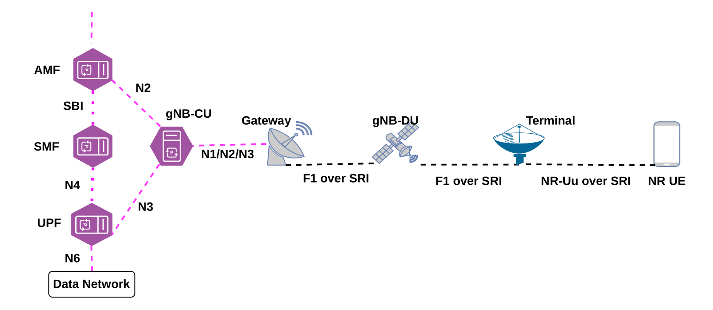
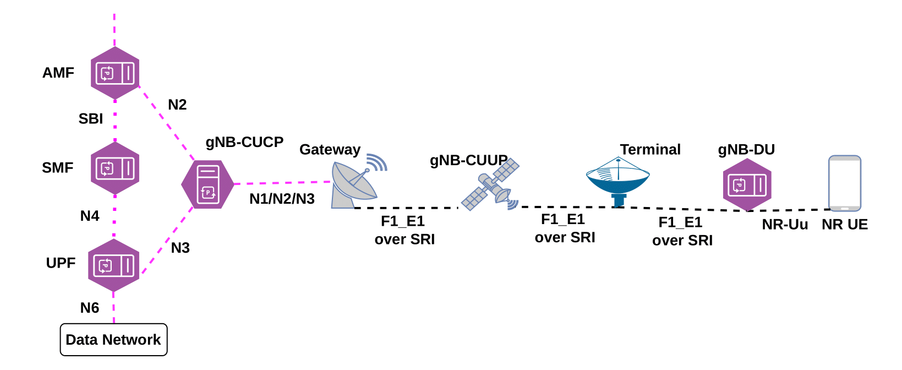

## Dissagregated NGRAN in 5G NTN networks

This repo is intended for the work "LSTM-based Resource Prediction for Disaggregated RAN in 5G Non-Terrestrial Networks"

## Build docker images for Free5GC core network:

Build Free5GC base image from directory: ./build_docker_images/f5gc_base

In the directory: ./build_docker_images/f5gc_core
     BUild the docker images with the tag defined in the docker-compose.yaml file of the same directory. 

## Or instead of building all the components, you can also pull all core network functions:

```
docker pull henok28/f5gc-amf:v3.1.1
```

## Build satellite emulator : opensand
The satellite emulator containers will build upon runing the docker-compose.yaml file from directory: ./build_docker_images/opensand

Three containers: Gateway, Satellite, and Terminal will be in runing state

## Pull dissagregated NGRAN images: Openairinterface5G


```
docker pull oaisoftwarealliance/oai-gnb:develop
```
```
docker pull oaisoftwarealliance/oai-nr-ue:develop
```

### Build Prometheus docker image from ./prometheus/Dockerfile

```
docker build -t custom-prometheus .
```

## Build Grafana docker image from: ./grafana/Dockerfile

```
docker build -t custom-grafana .
```
### There are two architectures for F1 split and F1_E1 split

<div align="center">
  
  <p style="font-size:14px; color:gray;">Figure 1: Emulated 5G NTN with F1 split</p>
</div>

#### Architecture one with F1 split across the 5GNTN network

<div align="center">
  
  <p style="font-size:14px; color:gray;">Figure 1: Emulated 5G NTN with F1_E1 split</p>
</div>

#### Architecture one with F1_E1 split across the 5GNTN network


### Build CAdvisor docker image from: ./cadvisor/Dockerfile

```
docker build -t custom-cadvisor .
```

## Start simulating the network:

### Start CAdvisor container: listens at port 8080
          http://<your-host-ip>:8080   #### url for CAdvisor

### Start Prometheus container: listens at port 9090
          http://<your-host-ip>:9090      #### url for Prometheus

### Start Grafana container: listens at port 3000
          http://<your-host-ip>:3000     #### url for Grafana

### make sure the three monitoring tools are configured properly with their IP

### Start the first network for architecture one:

```
docker compose -f docker-compose_with_F1_split.yaml up -d
```

##### Generate a video traffic using iperf3 and run the network for 10 hours

##### Collect resource consumption of gNB-DU using CAdvisor, Prometheus and visuallize using Grafana

               The collected data is located in ./LSTM_data/f1 directory

## Repeat the same procedure for the second architecture

### Prepare the data train, test and validate the LSTM model

## Results:

The code for the LSTM model taining and validation are: 

##### f1.ipynb for the first architecture
##### f1_e1.ipynb for the second architecture


