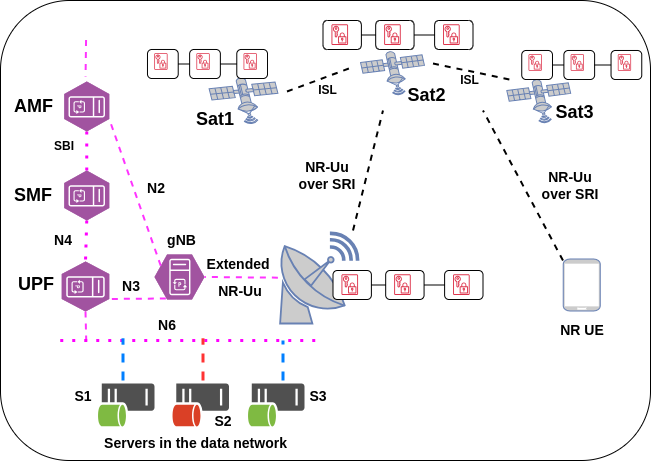
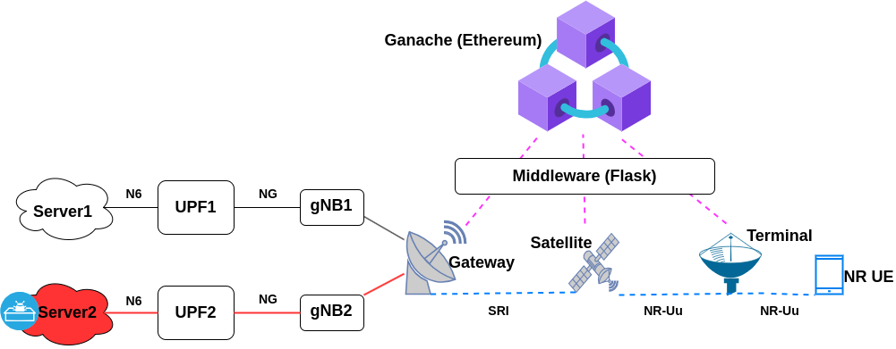

## Dissagregated NGRAN in 5G NTN networks

This repo is intended for the work "LSTM-based Resource Prediction for Disaggregated RAN in 5G Non-Terrestrial Networks"

## Build docker images for Free5GC core network:

Build Free5GC base image from directory: ./build_docker_images/f5gc_base

In the directory: ./build_docker_images/f5gc_core
     BUild the docker images with the tag defined in the docker-compose.yaml file of the same directory. 

## Or instead of building all the components, you can also pull all core network functions:

```
docker pull henok28/f5gc-amf:v3.1.1
```

## Build satellite emulator : opensand
The satellite emulator containers will build upon runing the docker-compose.yaml file from directory: ./build_docker_images/opensand

Three containers: Gateway, Satellite, and Terminal will be in runing state

## Pull dissagregated NGRAN images: Openairinterface5G


```
docker pull oaisoftwarealliance/oai-gnb:develop
```
```
docker pull oaisoftwarealliance/oai-nr-ue:develop
```

### Build Prometheus docker image from ./prometheus/Dockerfile

```
docker build -t custom-prometheus .
```

## Built Grafana docker image from: ./grafana/Dockerfile

```
docker build -t custom-grafana .
```
## There are two architectures for F1 split and F1_E1 split


## Built CAdvisor docker image from: ./cadvisor/Dockerfile

```
docker build -t custom-cadvisor .
```

## The end-to-end blockchain based 5G NTN networks are shown below:

</img>

These fugures shows the overall build network for secure blockchain based 5G NTN network

</img>

# Start the network:

## Start Ganache CLI:  Ganache starts listening at port 8545

```
docker compose -f docker-compose-ganache.yml up
```

## Compile and deploy smart contract:

From the directory: ./ethereum

```
truffle compile
```

This will create the compiled ABI file including the bytecode in the directory: ./ethereum/build/contracts

```
truffle migrate --network development
```

This will deploy the compiled smart contract into the Ethereum Virtual Machine (EVM) and contract address is returned from the lockal blockchain

## Start Midleware: Listens at port 5000

Fetch the contract address and private key of the first ethereum account to which the contract is deployed

Sample account address and key pair:

```
0x001c62F91F80A5a0eeCc6F60B78F641911024257 : 0x5be3d9d215fc14b01f67630ff66faca9a15f27bcd5bf848f3cb4fbe95eddc7ef
```

```
docker compose -f docker-compose-middleware.yml up
```

## Deploy the 5G NTN network to interact with Ganache via the middleware

```
docker compose up
```

The satellite components are configured to interact to Ganache

Now an end-to-end GTP tunnel will be established if the traffic going to the satellite network is authenticated by the blockchain

Sample Ethereum addresses of servers: 0x7db8a5b543406b96390a0703ce2e28bc84eb6529


